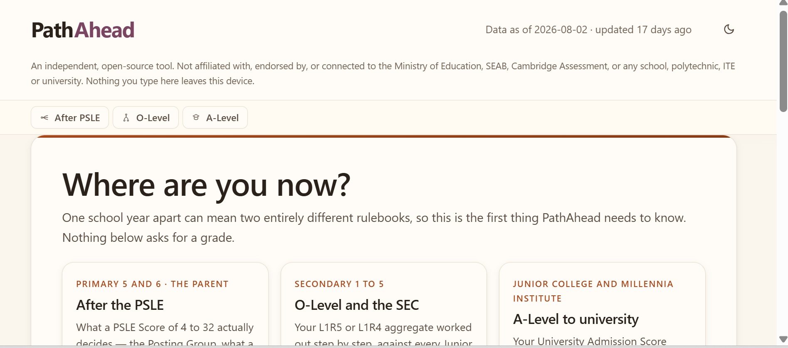
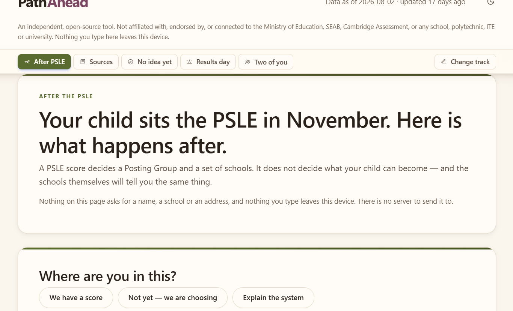
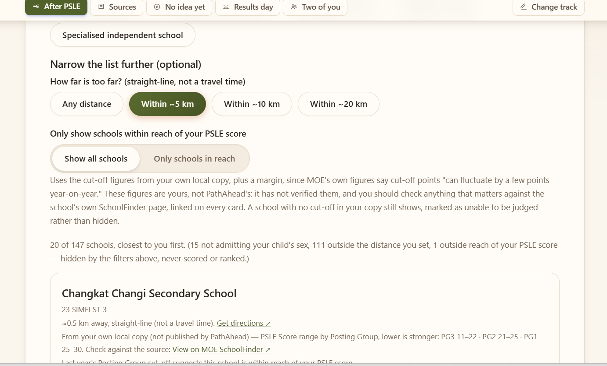
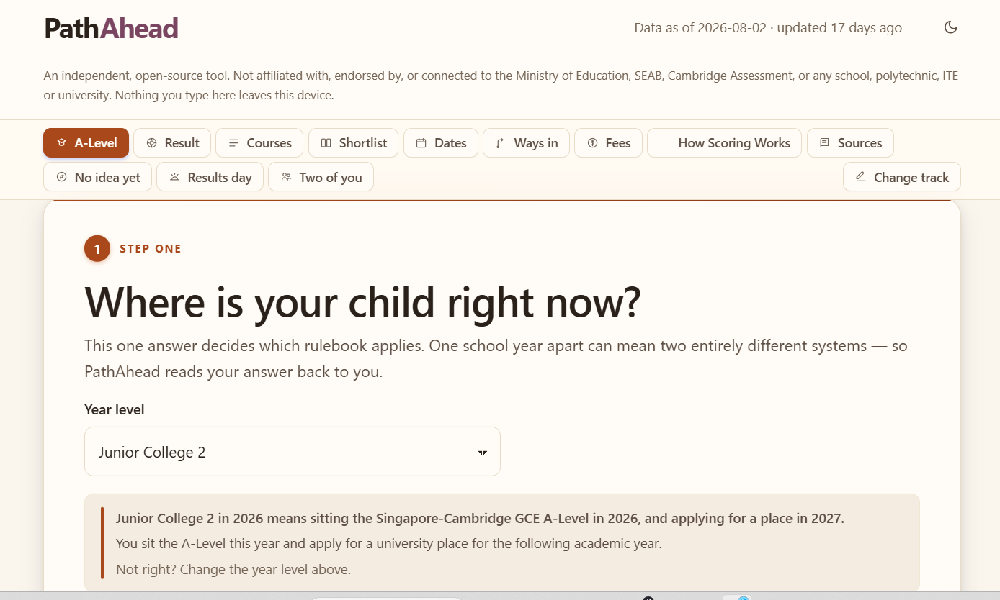
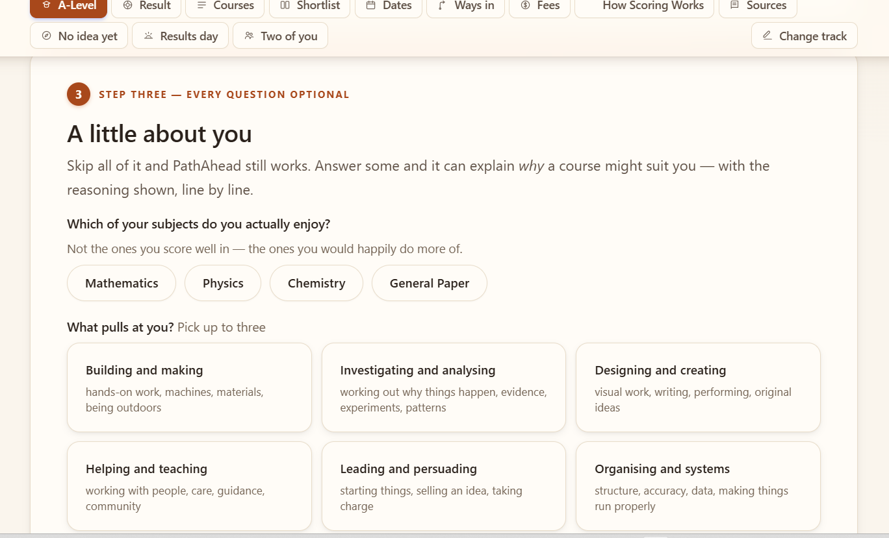
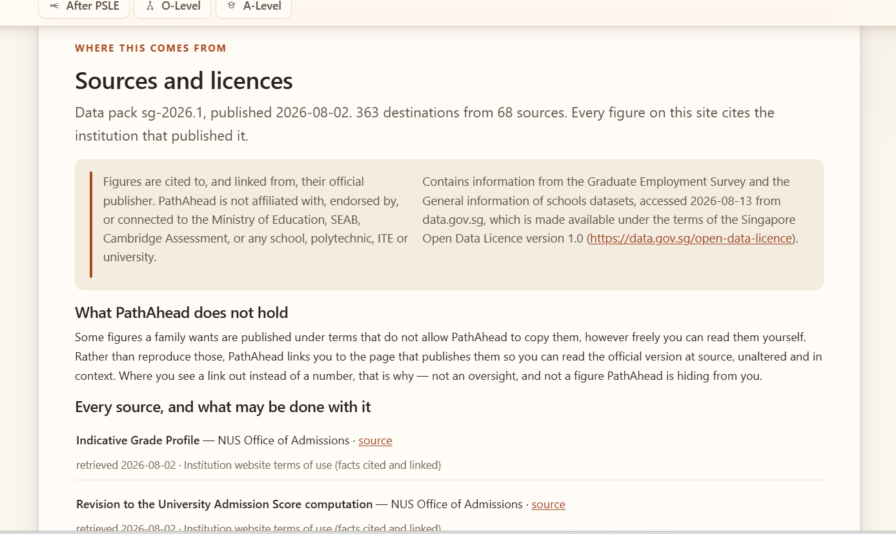

<div align="center">

# PathAhead

### Singapore's education system asks a child to choose three times. This explains all three.

**PSLE → secondary school · O-Level/SEC → JC, MI or polytechnic · A-Level → university**

Work out what a result actually means, see every place it can lead,
and find more than one way there.

**No account. No sign-up. Nothing you type ever leaves your device.**

[](LICENSE)




</div>

---

## The problem this exists for

Picture a Primary 6 parent in October. Their child sits the PSLE next month. They have heard that "AL" replaced the T-score, that there are now three Posting Groups, that some schools take you at 8 and others at 22, that DSA closed in July and they may have missed it. They do not know which of those things are true, which apply to *their* child, or what any of it forecloses.

Four years later the same family faces L1R5, ELR2B2, JAE, DSA-JC and a January posting exercise. Two years after that, a 70-point University Admission Score, six autonomous universities that do not admit on the same terms, and National Service sitting in the middle of the timeline.

Each fork has its own vocabulary, its own arithmetic, and its own deadlines. **And the rules keep moving:**

- **2026** — the A-Level University Admission Score dropped from 90 points to **70**. Three H2 subjects plus General Paper; Project Work no longer counts.
- **2027** — the O-Level and N-Level are withdrawn entirely, replaced by the **Singapore-Cambridge Secondary Education Certificate (SEC)**.
- **2028** — JC admission moves from **L1R5 ≤ 20** to **L1R4 ≤ 16**. Different formula, different ceiling, not comparable to the old one.

Every "PSLE calculator" and "L1R5 calculator" on the web hard-codes one formula into its source. A tool that treats *the* scoring rule as permanent is wrong by construction — and several of them are wrong right now, today, for the cohort currently sitting in a classroom.

PathAhead treats scoring rules as **versioned, dated, cited configuration**. When Singapore changes a rule, a YAML file changes — not the code. That is the entire architectural bet, and the 2027 cutover is what it was built for.

> ### It never answers with a single number.
> Ask what it takes to read Medicine and you get the published range, the subjects that route depends on, **and at least three ways in** — including the ones nobody puts on a calculator. The engine *refuses* to return fewer. "You need AAA," delivered alone to a seventeen-year-old, is a verdict, not guidance.

---

## What you actually get, stage by stage

### 1 · After the PSLE — for the parent of a Primary 5 or 6 child



The PSLE page opens with **no score box above the fold**. Before it asks for anything, it explains what an AL score of 4–32 actually decides — the Posting Group, and a set of schools — and what it does not. It reproduces MOE's full published Posting Group table so a parent can see the whole picture, not just their own row, and it states the DSA commitment *before* the application rather than after.

Then it helps with the real task: **shortlisting 147 secondary schools**.



Every school shows **by default**. Filters *hide* — they never rank, never score, and never sort by selectivity. The summary line always says exactly how many were hidden and why ("15 not admitting your child's sex, 111 outside the distance you set"), because a filter that quietly removes options is worse than no filter at all.

Distance is honest: a real straight-line kilometre figure, labelled as straight-line and *not* a travel time, computed on your device from a postal district — never geocoded to your address, never sent anywhere. A "Get directions" link carries only the **school's** own public address as the destination.

> **A single-sex school your child cannot attend is hidden outright**, not shown as a weak match. That is eligibility, not preference — a distinction the first version of this feature got wrong, and the tests now enforce.

### 2 · O-Level and the SEC — for Secondary 1 to 5

The only place, as far as we know, that models **both rulebooks side by side and refuses to mix them**. Pick your cohort and you get that cohort's own formula: L1R5/ELR2B2 for the last O-Level cohort sitting the 2027 JAE, or L1R4 for everyone on the SEC from 2028. The app tells you which rulebook applies to you *before* it asks for a single grade, because one school year apart genuinely means two different systems.

For the SEC-era cohort it computes a real aggregate from the real published formula — and then says plainly that **no institution has published a course cut-off under the new system yet**, because none has. Asserting one would be inventing a number.

### 3 · A-Level to university — for JC and MI students



Your University Admission Score, worked out line by line — which subjects counted, which were excluded and why, where the substitution kicked in, where the 70-point cap bit. **The worked answer is the product**, not the total.



Every personalisation question is optional and says so. Skip all of them and the tool still works — answering some only lets it explain *why* a course might suit you, with the reasoning shown line by line.

#### The thing every other calculator gets wrong right now

NUS states plainly that **no grade profile exists yet for the new 70-point score**, because AY2026/2027 is the first year it is used, and advises applicants to read the **three H2 grades** in the published profile as the indication of competitiveness instead.

So a calculator showing your 70-point score next to a published grade profile is comparing two different things. PathAhead computes your 70-point score, then compares **your three H2 grades against the three H2 grades in the profile** — and tells you on screen why those are two different numbers.

---

## The one rule that shapes everything: Evidence and Fit never blend

|  | **Evidence** | **Fit** |
|---|---|---|
| What it is | Your grades against last year's published admitted range | How well a course matches what *you* told us |
| Scored? | **Never.** Scoring it would mean predicting an admissions committee | **Yes, 0–100** — every point traces back to something you typed |
| Shown as | A named bucket and a range, with its year and its source | A score with a full derivation, reasons strongest first |

A course can score 92 on fit and sit below last year's range. That is exactly when the alternate routes matter most — so the app leads with them, not with the gap.

```
Information Security · NUS

FIT  84 / 100  strong
  +25  this course builds on computing, mathematics, which you said you enjoy
  +15  you do your best work through coursework, and so is much of this course
  +15  you said financial security matters, and its 2024 median was $6,110;
       you said a steady path matters, and 91.2% were employed within six months
  +10  this course is mostly individual work, which is what you prefer
  +10  no extra interview, test or portfolio is required
  +12.5 of 25  you chose investigating and analysing, which this course draws on
   +5 of 10    PathAhead has no fee figure for this course yet
  Based on 7 of the 8 things you told us.

EVIDENCE  Below last year's range
  Your 57.5 against AAA/B–AAA/A (2025), 3 H2 grades out of 60.
  Graduates 2024: $5,500–$7,049, median $6,110 · 91.2% employed in six months
  Not a prediction. 5 ways in ▸
```

Note the last line of the Fit block. When PathAhead has no fee figure, it awards half marks and **says so in the derivation** rather than silently scoring zero and letting a data gap masquerade as a bad match.

---

## Everything else it does

| | |
|---|---|
| 📅 **A calendar, not just a score** | The question at the kitchen table is *what closes first*. A personalised timeline of results, application windows, interviews, offers and acceptance deadlines — exportable |
| 🎖 **National Service is modelled** | For half the cohort the timeline is apply → defer → serve → start two years later. Nothing else models this, and it changes everything |
| 🔁 **"Can I change my mind?"** | Per course: late major declaration, common first year, what it keeps open and what it forecloses. The most useful thing you can tell someone who does not yet know themselves |
| 💷 **What happened to graduates** | Employment rate and salary as a **25th–75th percentile range** from the Graduate Employment Survey. Never a bare median, never a sort key — earnings enter fit only if you say they matter |
| 🎯 **Three honest buckets** | *Meets the stated requirement* / *Within last year's range* / *Below last year's range*. Never a probability, never "you missed the cut-off" |
| 📎 **Every number dated and cited** | `{value, as_of_year, source, licence, confidence, stale_after, basis}`. A figure past its publication cycle is greyed out and linked, never quietly shown as current |
| 🗣 **Opinions labelled as opinions** | Course descriptions are PathAhead's own, not the institution's. They render differently, never mix with published figures, and invite correction |
| ⚡ **Nothing to download** | Arithmetic over a few kilobytes. No model, no GPU, no key. Opens on a phone |
| 🌏 **Not Singapore-shaped underneath** | Stage → Transition → Outcome → Prerequisite → Route is country-agnostic. A new country is a data pack, not a rewrite |

---

## Get it running

### Download and double-click — no install, no Python

Grab the file for your machine from the [latest release](https://github.com/BaijayantaRoy/path-ahead/releases/latest) and double-click it. A browser opens on PathAhead, served from your own computer.

| Platform | File |
|---|---|
| Windows | `PathAhead-windows.exe` |
| macOS | `PathAhead-macos` |
| Linux | `PathAhead-linux` |

One file, about 7 MB, nothing to install. **Turn your wifi off and it still works** — the easiest way to check the privacy claim rather than take our word for it.

Windows and macOS will warn that the app is from an unidentified developer: these binaries are not code-signed, because certificates cost money this project does not take. On macOS right-click → Open; on Windows More info → Run anyway. If you would rather not, run from source below — it does exactly the same thing. Verify `SHA256SUMS.txt` on the release page either way.

### Run from source

```bash
git clone https://github.com/BaijayantaRoy/path-ahead && cd path-ahead
./PathAhead_Install.sh      # Windows: double-click PathAhead_Install.bat
./PathAhead_Start.sh        # Windows: double-click PathAhead_Start.bat
```

Your browser opens at `127.0.0.1:8902`. About three minutes; the installer's only dependency is a YAML reader.

**New to this kind of tool?** → [**Getting Started**](docs/GETTING_STARTED.md), a zero-assumption walkthrough. It is short, because there is no AI model to set up.

### From the command line

```bash
pathahead levels                       # which year levels this pack knows

pathahead score --year-level jc-2 \
  "h2 Chemistry=A" "h2 Biology=A" "h2 Mathematics=B" \
  "gp General Paper=A" "mtl Chinese=B"
```

```
Junior College 2 in 2026 means sitting A-LEVEL in 2026, applying for admission in 2027.

Your best 3 H2 subjects
  H2 Biology  A                            20
  H2 Chemistry  A                          20
  H2 Mathematics  B                      17.5
  Your 3 H2 subjects                     57.5
General Paper
  General Paper  A                         10
  Subtotal                               67.5
Optional extra -- counted only if it helps
  - H1 Economics  C                       7.5   not counted  the other optional subject scored higher
  Chinese  B                             8.75  counted - the higher of your optional subjects
  Subtotal                              76.25
  Capped at the maximum of 70              70
  University Admission Score               70

For comparing against published grade profiles, PathAhead uses 57.5 (your 3 best H2 grades, out of 60).
```

```bash
pathahead explore --year-level jc-2 ...   # score plus where it leads
pathahead plan nus-medicine               # what it takes, and 5 ways in
pathahead whatif --change h2-mathematics=A ...
pathahead health --gate                   # the data health report, as a CI gate
```

---

## Why you can trust the numbers

**Every figure is traceable.** 815 cited facts from 68 sources, each carrying its own publication year, licence, confidence level and staleness date. Nothing is "roughly" anything.



**Data health is a gate, not a report.** `pathahead health --gate` exits non-zero if any figure is past its `stale_after` date or below the confidence floor. CI runs it on every push. Credibility that is only *reported* drifts; credibility that is *enforced* holds.

**Two engines, cross-checked on every commit.** The browser build needs no Python runtime, so every scoring rule exists twice — once in `engine/rules/`, once inside `web/index.html`. Duplication is only safe if something checks it, so 37 golden fixtures record the exact value **and every trace step** the Python engine produced, and CI replays all of them through the JS engine extracted from the live HTML. Disagreement beyond `1e-9` fails the build. It caught a real bug on its first run.

**The app tells you what it does not know.** Where a figure is missing, the page says it is missing — it never renders a zero, a blank, or a plausible guess. Where an institution publishes nothing (SUTD publishes no indicative grade profile and says so), PathAhead reports that rather than filling the gap.

---

## What it refuses to do

[**SAFEGUARDS.md**](SAFEGUARDS.md) was written before the first line of code, and most of it is enforced by tests rather than intentions:

- **It collects nothing.** No name, NRIC, school, email or account — the fields do not exist. Singapore's PDPC treats anyone 18 or younger as a child, and the PSLE audience is under 13. The cleanest answer to that is to hold no data at all. CI greps for identity fields on every push.
- **It never ranks schools.** No league table, no sort by selectivity, anywhere. Tested, not just intended.
- **It never says you missed the cut-off.** A banned-phrase list is checked against every string the engine can emit. When a reassuring sentence trips the guard, the project rewrites the sentence — never the guard.
- **It never hides a caveat.** Interviews, portfolios, aptitude tests and subject prerequisites travel with the outcome and are always shown.
- **It loads nothing from anyone else's server.** No fonts, no analytics, no CDN, no trackers. A Content-Security-Policy travels *inside* `index.html` so the guarantee survives GitHub Pages, a USB stick, or a `file://` open. CI fails on any external URL outside a short, documented allowlist.
- **It points at humans.** Teachers, the school's ECG counsellor and the institution's admissions office are on the results screen, not buried in an FAQ.

**Something look wrong?** Every figure carries a report link that opens a pre-filled issue. A tool claiming citation rigour with no correction path has a hole exactly where its credibility should be.

### Where AI fits — and where it deliberately does not

**Tier 0 is complete on its own.** With no key, no GPU, no model and no internet you get correct numbers, the full derivation, plain-English explanations, cited sources, three-bucket results and every route. Everything above that is a comfort, never a capability gate.

| Tier | What | Ships enabled | Needs |
|---|---|---|---|
| **0 — Core** | Engine, trace, explanations, buckets, backward mode, citations | ✅ **Yes** | Nothing |
| **1 — Narrator** | Plain-English rewrite, tone per reader, what-if dialogue | ❌ Opt-in | Local Ollama, an OpenAI-compatible endpoint, or a subscription you already have |
| **2 — OCR** | Photograph the results slip instead of typing | ❌ Opt-in | A local or cloud vision model |
| **3 — Pack copilot** | Official PDFs → drafted pack + citations + review checklist | 🚫 **Maintainer-only, never in the user app** | A frontier model |

If the narrator is ever switched on, one mechanism makes "the AI never invents a number" true rather than merely requested: it receives **only** the computed result object, every numeric token in its output is extracted, and each must appear in the derivation's own set of numbers or be a difference of two of them. **One unmatched number rejects the entire narration** and the deterministic template is shown instead. `tests/test_guardrail.py` runs invented cut-offs, fabricated percentages and hallucinated years against it in CI.

---

## Coverage, honestly

| Stage | What's loaded |
|---|---|
| **PSLE → Secondary** | All **147** government and government-aided secondary schools, with MOE's full Posting Group table. Filters for distance, SAP, IP, Autonomous status, GEP, school type and single-sex/co-ed. Cut-off figures are **deliberately not shipped** — see below |
| **O-Level / SEC → JC, MI, Poly** | Both rulebooks: L1R5/ELR2B2 for the 2027 JAE, L1R4 for the SEC era from 2028. 16 of ~19 JAE-entry JCs plus Millennia Institute with cited ranges; polytechnic ELR2B2 outcomes shared with the A-Level pack |
| **A-Level → University / Poly** | **296 courses across all eleven** post-secondary institutions — six autonomous universities, five polytechnics — with grade profiles, fees, employment outcomes and the subject-prerequisite graph |

**Last data-health run:** 815 facts (805 high confidence, 10 medium, 0 low) · 68 sources · 27 institutions · 363 outcomes · 15 routes · 351 editorial statements, every one labelled as opinion.

**Known gaps, on purpose rather than by omission:**

- Per-programme subject prerequisites are PDFs that change annually — PathAhead links to them rather than copying them.
- The 70-point grade-to-point table is marked **medium confidence**: structure corroborated, exact table pending primary confirmation. The app says so rather than burying it.
- 3 of ~19 JAE-entry JCs have no cited grade range yet — tracked in [NEXT.md](NEXT.md).
- No course cut-offs exist for the SEC era, because none have been published.

---

## Disclaimers & limitations

Read this before relying on anything the app shows you. The fuller version, with the reasoning behind each line, is in [SAFEGUARDS.md](SAFEGUARDS.md) and in the app under **Sources → What PathAhead is, and what it is not**.

**Not official, not affiliated.** An independent, unofficial project. Not built, reviewed, endorsed or connected in any way to the Ministry of Education, SEAB, Cambridge Assessment, or any school, junior college, polytechnic, ITE or university named in it. No crest or institution name appears in the product's own name. Facts are encoded from public sources and linked back; nothing from an institution's materials is reproduced wholesale.

**Not advice.** PathAhead explains how published rules work. It does not recommend a school, a course, or a decision, and matching one well here is not by itself enough to secure a place anywhere. For a real decision about a child's education, talk to their teachers, the school's ECG counsellor, or the institution's admissions office — the app says this on the results screen, not only here.

**Figures are last year's, not a prediction.** Grade profiles, Posting Group ranges, employment outcomes and fees are what was published for a *previous* intake. Criteria and processes change — sometimes substantially, as with the 2026 scoring change and the 2027–28 SEC cutover this project exists because of. A published range is evidence to reason with, never a threshold that decides anything.

**PSLE Posting Group cut-off figures are deliberately not shipped.** MOE's Terms of Use reserve reproduction rights over its published tables, and this project's rule is: where a fair-dealing argument would be needed to justify shipping something, it does not ship it. Every school card instead deep-links to that school's own page on **MOE SchoolFinder** — you get this year's figure, from the source, on a page MOE controls. If you want your own research available offline, the app supports a private, local-only data file that is gitignored, never committed, never bundled into a release binary, and never uploaded anywhere: see [docs/LOCAL_DATA.md](docs/LOCAL_DATA.md). What you do with data you gather yourself is your call and your responsibility, not this project's.

**Best-effort accuracy, not a guarantee of correctness.** Every number is dated, cited and linked — but transcription errors and stale figures are possible in any project maintained by one person. Verify anything important against the primary source; the citation is right there for exactly that reason.

**Singapore-specific, and current-system-specific.** The pack models Singapore's PSLE, O-Level/SEC and A-Level systems as published as of the date on each source. Nothing here applies outside Singapore.

**No warranty, used at your own risk.** Provided "as is" — see [LICENSE](LICENSE). The maintainer accepts no liability for decisions made using this tool. Nothing here is legal, financial or professional advice.

**Privacy is a property of the code, not a promise on top of it.** Nothing you type is collected, transmitted or stored — there is no server to send it to. If you self-host or run the desktop build, securing your own device and network is yours, as with any application you choose to run.

**Accountability.** PathAhead's job is to lay out what is publicly known, cited and dated, and to offer an honest set of choices within Singapore's actual rules — not to make a choice for you or to stand behind one. Decisions about a child's education remain the user's own.

---

## Under the hood

```
engine/
├── model.py         Stage · Transition · Outcome · Prerequisite · Route · Cohort · Fact
├── rules/           one tested module per rule kind; each narrates its own arithmetic
├── cohort.py        "what year is your child in" -> which rulebook applies
├── forward.py       results -> options, in three named buckets
├── backward.py      destination -> what it takes + >=3 routes (MIN_ROUTES enforced)
├── school_fit.py    the PSLE shortlist: filters and one eligibility gate, never a score
├── explain.py       Tier-0 plain English, built from the trace. No model involved
├── guardrail.py     the numeric guardrail for the optional AI narrator
└── health.py        Data Health, as a CI gate rather than a nice report
packs/singapore/     the data: sources, cohorts, transitions, outcomes, routes, schools
web/index.html       the whole browser app, one self-contained file (built from web/src/)
tools/               pack compiler · golden generator · cross-engine check · desktop build
evals/golden/        fixtures replayed through BOTH engines in CI
```

**Rule *kinds*, not a formula language.** A pack names a rule kind and supplies typed parameters. There is no expression evaluator and no arbitrary execution surface. The reason is not only safety: an expression string can return `70.0`, but a rule kind can explain *"your Mother Tongue was counted because it scored higher than your H1 Economics"*.

| Kind | Shape | Used by |
|---|---|---|
| `weighted_best_n_with_substitution` | best N + compulsory + best-of bonus, capped | A-Level UAS (70) |
| `lowest_sum` | sum all, lower is better | **PSLE (AL1–AL8, 4–32)** |
| `required_plus_best_n` | one compulsory + best N, lower is better | L1R5, **L1R4 (2028)**, ELR2B2 |

L1R5 and the incoming L1R4 are *the same kind with different numbers*. That is the architecture's whole claim: the 2028 policy change is a data edit, not a rewrite.

**Verification on every push:** `ruff` · 305 tests · 37 cross-engine golden fixtures · 116 DOM checks driving the real HTML · 19 static-site checks · the data-health gate · and grep-based safeguard gates for identity fields, telemetry, external resources, the meta CSP, and cut-off figures in tracked packs.

---

## Help build this

The engine is the easy part. **The data is the project**, and the people best placed to catch a wrong figure are teachers, counsellors and parents who deal with these rules every year.

**If you teach or advise** — no code needed. Check a figure against its source and tell us if it is wrong (every number has a report link). Add a route we are missing — a route not listed is a door a student never sees. Sharpen the copy: if a sentence would land badly on a seventeen-year-old reading it alone at midnight, that is a bug worth reporting.

**If you build** — the seams are clean: a new country is a pack, a new formula shape is a rule kind plus golden fixtures, and both engines are cross-checked for you. Start with [CONTRIBUTING.md](CONTRIBUTING.md) and [docs/PACK_AUTHORING.md](docs/PACK_AUTHORING.md).

### Documentation

[Getting Started](docs/GETTING_STARTED.md) · [Pack Authoring](docs/PACK_AUTHORING.md) · [SAFEGUARDS.md](SAFEGUARDS.md) · [ARCHITECTURE.md](ARCHITECTURE.md) · [SECURITY.md](SECURITY.md) · [CONTRIBUTING.md](CONTRIBUTING.md) · [docs/LOCAL_DATA.md](docs/LOCAL_DATA.md) · [ROADMAP.md](ROADMAP.md) · [CHANGELOG.md](CHANGELOG.md)

---

## Licence

[MIT](LICENSE) — free forever, for everyone.

The **software** is MIT. The **data** carries its own per-source terms, recorded on every source record and summarised in [SAFEGUARDS.md §3](SAFEGUARDS.md). Figures from data.gov.sg are used under the [Singapore Open Data Licence v1.0](https://data.gov.sg/open-data-licence).

> PathAhead explains how the published rules work. It does not tell you what to choose. For decisions about a child's education, speak to their school's teachers and Education & Career Guidance counsellor, or the institution's own admissions office.
